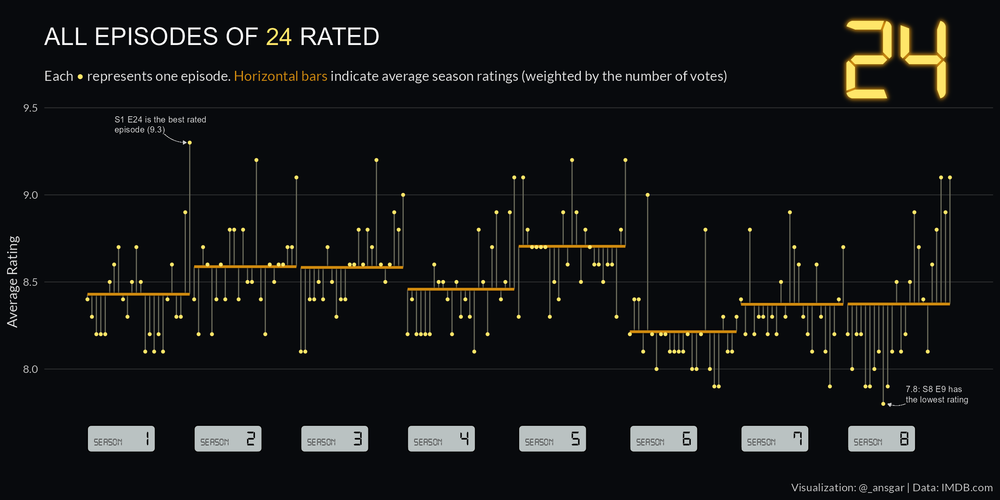

```{r setup, include=FALSE}
knitr::opts_chunk$set(echo = TRUE)
```




## Inspiration

Cedric Scherer's visualization of the ratings for "The Office": 

<blockquote class="twitter-tweet"><p lang="en" dir="ltr"><a href="https://twitter.com/hashtag/TidyTuesday?src=hash&amp;ref_src=twsrc%5Etfw">#TidyTuesday</a> Week 2020/12 - The Office on <a href="https://twitter.com/IMDb?ref_src=twsrc%5Etfw">@IMDb</a> 👨‍💼<br><br>A simple one since I have to catch up on a few weeks. And guess it&#39;s my first waterfall chart ever 🤷‍♂️<a href="https://twitter.com/hashtag/r4ds?src=hash&amp;ref_src=twsrc%5Etfw">#r4ds</a> <a href="https://twitter.com/hashtag/ggplot2?src=hash&amp;ref_src=twsrc%5Etfw">#ggplot2</a> <a href="https://twitter.com/hashtag/tidyverse?src=hash&amp;ref_src=twsrc%5Etfw">#tidyverse</a> <a href="https://twitter.com/hashtag/rstats?src=hash&amp;ref_src=twsrc%5Etfw">#rstats</a> <a href="https://twitter.com/hashtag/dataviz?src=hash&amp;ref_src=twsrc%5Etfw">#dataviz</a> <a href="https://t.co/YV9NqO85aw">pic.twitter.com/YV9NqO85aw</a></p>&mdash; Cédric Scherer 💉 (@CedScherer) <a href="https://twitter.com/CedScherer/status/1242229041488433152?ref_src=twsrc%5Etfw">March 23, 2020</a></blockquote>
<script async src="https://platform.twitter.com/widgets.js" charset="utf-8"></script>

## Data

Ratings are averaged ratings from IMDB users, which can be downloaded from these links:

* Datasets: https://datasets.imdbws.com/
* Documentation: https://www.imdb.com/interfaces/

## Packages worth mentioning

It is the first plot I've created using the [{ragg} package](https://cran.r-project.org/web/packages/ragg/readme/README.html). {ragg} implements AGG for R, which provides higher quality graphics. I used the function `with_outer_glow` from the [{ggfx}](https://github.com/thomasp85/ggfx) package to create the glow effect in the "24" writing.
