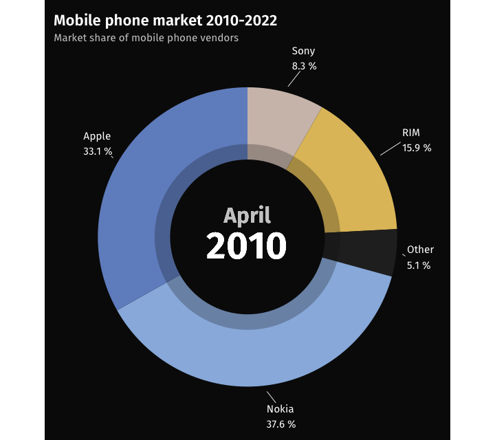

```{r setup, include=FALSE}
knitr::opts_chunk$set(echo = TRUE)
```

## The original animation

[Visual Capitalist](https://www.visualcapitalist.com/) published an animation created by James Eagle showing how smartphone vendor market shares developed over 30 years. In the center of the visualization is a donut chart displaying monthly market share values. The chart includes a legend, which repeats the share per manufacturer. Manufacturers displayed in the donut chart are highlighted in the legend.

The goal of this tutorial is to **create the animated donut chart in R with {ggplot2}**. We will use another data source due to availability and (for now) not create the legend.

<blockquote class="twitter-tweet"><p lang="en" dir="ltr">Animation: How the Mobile Phone Market Has Evolved Over 30 Years 📲<br><br>Article: <a href="https://t.co/7JfDGv4EYe">https://t.co/7JfDGv4EYe</a><br><br>Courtesy of creator <a href="https://twitter.com/JamesEagle17?ref_src=twsrc%5Etfw">@JamesEagle17</a> <a href="https://t.co/4wrxHE3LSQ">pic.twitter.com/4wrxHE3LSQ</a></p>&mdash; Visual Capitalist (@VisualCap) <a href="https://twitter.com/VisualCap/status/1521917651454361601?ref_src=twsrc%5Etfw">May 4, 2022</a></blockquote> <script async src="https://platform.twitter.com/widgets.js" charset="utf-8"></script>

```{=html}
<script async src="https://platform.twitter.com/widgets.js" charset="utf-8"></script>
```

## Packages

Let's load the packages we will use for creating the animation, especially {ggplot2} via the Tidyverse and [{gganimate}](https://gganimate.com/index.html).

```{r packages, message=FALSE}
library(tidyverse)
library(gganimate)
library(ggtext)
library(lubridate)
```

## Get the data

[Statcounter](https://gs.statcounter.com/) provides mobile vendor market shares back to 2010. The original animation goes back to the 1990s and uses data which are not openly available.

### A peak at methodology

Statcounter gives an overview about how the data is collected in their [FAQ](https://gs.statcounter.com/faq#methodology) section:

> Statcounter is a web analytics service. Our tracking code is installed on more than 2 million sites globally. These sites cover various activities and geographic locations. Every month, we record billions of page views to these sites. For each page view, we analyse the browser/operating system/screen resolution used and we establish if the page view is from a mobile device.

Statcounter data is licensed under a [Creative Commons Attribution-Share Alike 3.0 Unported License](https://creativecommons.org/licenses/by-sa/3.0/). It can be downloaded in CSV format via https://gs.statcounter.com/vendor-market-share/mobile/worldwide/#monthly-201003-202205. After the download, place the CSV file in your project directory before loading it into the R session. We are using the maximum period available, which is March 2010 to May 2022 (as of writing this tutorial).

```{r read_data, message=FALSE}
filename <- "vendor-ww-monthly-201003-202205.csv"
df_raw <- read_csv(filename)
n_vendors <- ncol(df_raw) - 1
```

Here are the first 10 rows and the first 10 columns of the data frame:

```{r}
knitr::kable(df_raw[1:10, 1:10])
```

Each vendor's market share is coded in a column. In total, the market shares from `r n_vendors` vendors are available in the data frame. Some brand names resemble memories of "old" times.

```{r}
colnames(df_raw)
```

## Transform the data

For our plot, we have to transform the data frame into long format, i.e. each vendor will be encoded in a row instead of a column. Since displaying all vendors would lead to a cluttered chart, we lump vendors with smaller market shares into an "Other" category. There are a couple of months with a rather high shares of "Unknown" - we group "Unknown" into "Other" as well. All vendors with a market share below the threshold will be recoded as "Other" month by month. (The threshold is eventually chosen so that the number of colors in the selected color palette is not exceeded.)

```{r transform_data}
threshold_for_lumping <- 3.1

df_long <- df_raw %>%
  pivot_longer(cols = -Date, names_to = "vendor", values_to = "market_share") %>% 
  # group vendors with smaller market shares to "Other" based on monthly shares
  mutate(
    vendor2 = ifelse(market_share < threshold_for_lumping | vendor == "Unknown", "Other", vendor),
    date = ym(Date)) %>% 
  # the data from March 2010 is incomplete, remove it
  filter(date > as_date("2010-03-01")) %>% 
  count(date, vendor2, wt = market_share, name = "market_share")

```

The first few rows of the transformed data frame:

```{r}
head(df_long)
```

Here are all vendors in the new grouped variable. These vendors will appear in the chart at least in one month:

```{r}
unique(df_long$vendor2)
```

## First plot with facets

Let's create the first basic graph, capturing the market share for each month of the first year in the data frame:

```{r first_plot}

df_long %>% 
  filter(date <= as_date("2011-03-01")) %>% 
  ggplot(aes(vendor2, market_share)) +
  geom_col() +
  coord_flip() +
  facet_wrap(vars(date))

```

## Create a donut chart with ggplot2

{ggpubr} is a great package which provides wrapper functions for creating several chart types without all the details of {ggplot2}, including [donut charts](https://rpkgs.datanovia.com/ggpubr/reference/ggdonutchart.html). Since we will be making some customizations for our animation, we will create the plot from scratch in {ggplot2}, though.

### Start with a pie chart

The base for the donut chart is a pie chart. Creating pie charts in {ggplot2} works just like creating a stacked bar chart in a polar coordinate system. We achieve this by adding `coord_polar(theta = "y")` to the plot. For this static chart we select the most recent month.

Instead of the default color palette we use the Lapras palette from the {palettetown} package.

```{r first_pie}
df_long %>% 
  filter(date == as_date("2022-05-01")) %>%
  ggplot(aes(x = 1, market_share, group = vendor2)) +
  geom_col(aes(fill = vendor2), position = "fill") +
  paletteer::scale_fill_paletteer_d("palettetown::lapras") +
  coord_polar(theta = "y") +
  theme_void() # removes all theme elements
```

Adding the labels for each category is a bit trickier. We have to calculate the label position from the cumulative sums. We use the vendor name and the market share as data labels.

(...)

```{r transform_data_for_labels}

df_long_with_labels <- df_long %>% 
  mutate(vendor2 = factor(vendor2, levels = unique(df_long$vendor2))) %>% 
  # calculate the label position within each month
  group_by(date) %>% 
  arrange(desc(vendor2), .by_group = TRUE) %>% 
  mutate(
    label_pos = cumsum(market_share) / sum(market_share) 
    - 0.5 * market_share / sum(market_share),
    label = sprintf("%s\n%s %%", vendor2, 
                    scales::number(market_share, accuracy = 0.1)),
    label = fct_reorder(label, market_share)) %>% 
  ungroup() 

```

(...)

```{r pie_with_labels}
p <- df_long_with_labels %>% 
  filter(date == as_date("2022-05-01")) %>%
  ggplot(aes(x = 1, market_share, group = vendor2)) +
  geom_col(aes(fill = vendor2), position = "fill") +
  geom_label(aes(x = 1.5, label = label, y = label_pos)) + 
  paletteer::scale_fill_paletteer_d("palettetown::lapras") +
  coord_polar(theta = "y") +
  guides(fill = "none") +
  theme_void()
p
```

### ... and the donut

We just simply add a white circle (i.e. same color as the background) on top of the pie chart. Voilà, a **donut chart**. Adjust `donut_hole_width` to change the size of the inner ring. A value of 0 will result in a pie chart, a value of 1.5 or greater will cover the whole pie chart.

Inside the inner ring we display the month using `geom_text()`. For now this is a static value. We will later change the value based on the month displayed in the animated chart. 

```{r}
# adjust the size of the inner ring
donut_hole_width <- 0.75

p + 
  annotate("rect", xmin = 0, xmax = donut_hole_width, ymin = -Inf, ymax = Inf,
           fill = "white") +
  geom_text(aes(x = 0, y = 0, label = format(date, "%B\n%Y")), stat = "unique",
            size = 8)
```

### Adjust the theme

Next we adjust the appearance of the chart. We change the **background color** to dark grey / black and set the font. 

```{r define_custom_theme}
custom_theme <- function() {
  theme_void(base_family = "Fira Sans") + 
  theme(
    plot.background = element_rect(color = NA, fill = "grey4"),
    plot.margin = margin(10, 10, 10, 10),
    text = element_text(color = "grey80"),
    plot.title = element_text(
      family = "Fira Sans SemiBold", color = "white", size = 16),
    plot.title.position = "plot" # aligns the title with the plot instead of the panel
  )
}
```

Furthermore, we place another circle on top of the inner ring (yes, it's a `geom_rect` in the polar coordinate system) to achieve the **semi-transparent effect** from the original chart. We change the month label as well: the year is highlighted (white and a larger font size), while the month is shown in a smaller font and light grey color. We replace `geom_label()` with `geom_text_repel()` from the [{ggrepel}](https://ggrepel.slowkow.com/index.html) package and force the segment lines to be shown anytime with `min.segment.length = 0`.

```{r formatted_donut} 
df_long_with_labels %>% 
  filter(date == as_date("2022-05-01")) %>%
  ggplot(aes(x = 1, market_share, group = vendor2)) +
  geom_col(aes(fill = vendor2), position = "fill") +
  ggrepel::geom_text_repel(
    aes(x = 1.5, label = label, y = label_pos),
    hjust = 0, family = "Fira Sans", segment.size = 0.3, min.segment.length = 0, 
    nudge_x = 0.3, point.padding = 1e-05, color = "white") + 
  # semi-transparent ring
  annotate("rect", xmin = 0, xmax = donut_hole_width + 0.15, ymin = -Inf, ymax = Inf,
           fill = alpha("grey4", 0.25)) +
  # inner ring
  annotate("rect", xmin = 0, xmax = donut_hole_width, ymin = -Inf, ymax = Inf,
           fill = "grey4") +
  geom_richtext(
    aes(
      x = 0, y = 0,
      label = sprintf(
        "<span style='color: grey80'>%s</span><br>
        <span style='font-size: 40pt'>%s</span>", 
          format(date, "%B"), year(date))), 
                stat = "unique", size = 8, family = "Fira Sans SemiBold", color = "white",
                fill = NA, label.size = 0, lineheight = 1.67) + 
  paletteer::scale_fill_paletteer_d("palettetown::lapras") +
  coord_polar(theta = "y") +
  guides(fill = "none") +
  custom_theme()
```


## Animate the donut chart

Finally, we animate the donut chart. 

```{r animation}

p_donut <- df_long_with_labels %>% 
  ggplot(aes(x = 1, market_share, group = vendor2)) +
  geom_col(aes(fill = vendor2), position = "fill") +
  ggrepel::geom_text_repel(
    aes(x = 1.5, label = label, y = label_pos),
    hjust = 0, family = "Fira Sans", segment.size = 0.3, min.segment.length = 0, 
    nudge_x = 0.3, point.padding = 1e-05, color = "white") +
  # semi-transparent ring
  annotate("rect", xmin = 0, xmax = donut_hole_width + 0.15, ymin = -Inf, ymax = Inf,
           fill = alpha("grey4", 0.25)) +
  # inner ring
  annotate("rect", xmin = 0, xmax = donut_hole_width, ymin = -Inf, ymax = Inf,
           fill = "grey4") +
  geom_richtext(
    aes(x = 0, y = 0, label = sprintf(
        "<span style='color: grey80'>%s</span><br><span style='font-size: 40pt'>%s</span>", 
          format(date, "%B"), year(date))), 
                stat = "unique", size = 8, family = "Fira Sans SemiBold", color = "white",
                fill = NA, label.size = 0, lineheight = 1.67) +
  paletteer::scale_fill_paletteer_d("palettetown::lapras") +
  coord_polar(theta = "y") +
  guides(fill = "none", color = "none") +
  labs(
    title = "Mobile phone market 2010-2022",
    subtitle = "Market share of mobile phone vendors",
    caption = "**Source:** Statcounter. **Visualization:** Ansgar Wolsing"
  ) + 
  custom_theme()

# # Animate along each month
# p_anim <- p_donut +
#   transition_states(date)
# 
# # increase this to increase the resolution and adjust width and height at the same time
# resolution_factor <- 1.5
# anim <- animate(p_anim, res = resolution_factor * 100,
#                 width = resolution_factor * 720, height = resolution_factor * 600,
#                 fps = 12, duration = 60)
# anim_save("animated-donut-chart.gif", anim)
```



