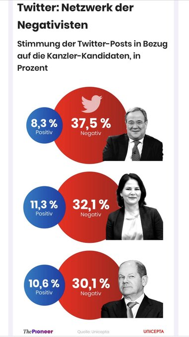

```{r setup, include=FALSE}
knitr::opts_chunk$set(echo = FALSE,
                      include = TRUE)

pacman::p_load("tidyverse", "ggtext", "glue")

theme_set(
  theme_minimal(base_family = "Lato", base_size = 10) +
    theme(legend.position = "top", legend.justification = "left", legend.key.height = unit(2.5, "mm"),
          plot.background = element_rect(color = NA, fill = "grey98"),
          panel.grid = element_blank(),
          panel.grid.major.y = element_line(size = 0.1, color = "grey89"),
          text = element_text(color = "grey30", lineheight = 1.2),
          plot.title = element_markdown(color = "grey2", family = "Lato",
                                        face = "bold", size = 20,
                                    margin = margin(t = 6, b = 12)),
          plot.subtitle = element_markdown(size = 10, face = "plain", 
                                           margin = margin(b = 12)),
          plot.caption = element_markdown(size = 7, hjust = 0,
                                          margin = margin(t = 0)),
          plot.title.position = "plot",
          axis.title = element_text(color = "grey45"),
          axis.title.y = element_text(hjust = 1),
          axis.text = element_text(color = "grey45"),
          plot.margin = margin(t = 8, l = 8, r = 8, b = 8))
)

colors <- c(
  "positiv" = "#0C60B9",
  "negativ" = "#C41215",
  "neutral" = "grey50"
)


```

## Originalgrafik 


Quelle: The Pioneer, Unicepta

```{r data}

df <- tribble(
  ~name, ~nachname, ~negativ, ~positiv,
  "Armin Laschet", "Laschet", 0.083, 0.375,
  "Annalena Baerbock", "Baerbock", 0.113, 0.321,
  "Olaf Scholz", "Scholz", 0.108, 0.301
) %>% 
  mutate(neutral = 1 - (negativ + positiv))

df_long <- df %>% 
  pivot_longer(cols = negativ:neutral, names_to = "sentiment", values_to = "anteil") %>% 
  mutate(sentiment = factor(sentiment, levels = c("neutral", "positiv", "negativ")))

```


```{r plot}

name_labels <- tibble(
  name = c("Olaf Scholz", "Annalena Baerbock", "Armin Laschet"),
  x = seq(3.3, 1.3, -1)
)

df_long %>% 
  arrange(nachname, sentiment) %>% 
  group_by(nachname) %>% 
  mutate(label_pos = cumsum(anteil) - anteil / 2) %>% 
  ungroup() %>% 
  mutate(sentiment = fct_rev(sentiment),
         nachname = fct_reorder(nachname, -anteil),
         label = sprintf("**%s**", 
                         scales::percent(anteil, accuracy = 1, 
                                         decimal.mark = ",")),
         label = ifelse(nachname == "Scholz", 
                        glue("{label}<br>{sentiment}"),
                        label
                        )) %>% 
  ggplot(aes(nachname, anteil)) +
  geom_col(aes(fill = sentiment), 
           position = "stack", width = 0.5, alpha = 0.97,
           show.legend = FALSE) +
  geom_richtext(aes(label = label), 
            position = position_stack(vjust = 0.5),
            fill = NA, label.color = NA,
            col = "white", family = "Lato", size = 3) +
  # geom_text(aes(x = 3.25, y = 0, label = "Olaf Scholz"),
  #           stat = "unique", color = "grey25",
  #           vjust = -0.5, hjust = 0, fontface = "bold") +
  geom_text(data = name_labels, 
            aes(x, y = 0, label = name),
            stat = "unique", color = "grey30", family = "Lato",
            vjust = -0.5, hjust = 0, fontface = "bold") +
  scale_y_continuous(guide = "none") +
  scale_fill_manual(values = colors) +
  coord_flip() +
  guides(fill = guide_legend(reverse = TRUE)) +
  labs(title = glue("Tweets über die Kanzlerkandidat:innen sind<br>
                    <span style='color:{colors[\"neutral\"]}'>mehrheitlich neutral</span>"),
       subtitle = "Stimmung der Tweets in Bezug auf die Kanzlerkandidat:innen in Prozent",
       caption = "Daten: **ThePioneer, Unicepta** | Visualisierung: **@_ansgar**",
       x = NULL, y = NULL, fill = NULL) +
  theme(# axis.text.y = element_text(color = "grey8", size = 10),
        axis.text.y = element_blank())

```

